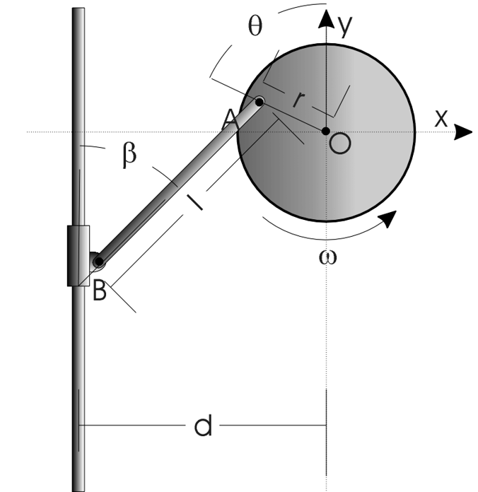

# Provided Unverified Derivation - Locomotive Crank Kinematics

---

## Student Instruction

The following derivation is provided so that this lab can focus on data analysis and model validation rather than deriving the crank-slider kinematics from scratch. Treat it as **provided but unverified**. Review the geometry, sign conventions, and algebra before using the final equation in your analysis.

Verification is the right word here: students are not being asked to create an original derivation, but they are responsible for checking whether the provided derivation is internally consistent and appropriate for the data they analyze.

---

## Geometry And Variables

The apparatus consists of:

- A disk rotating about fixed point O
- A crank pin A located a radius r from O
- A rigid connecting bar of length l from A to the sliding collar point B
- A vertical slide for B
- A horizontal offset d from the vertical slide to the disk centerline

Variables:

| Symbol | Meaning |
|--------|---------|
| θ | Disk angle |
| β | Connecting-bar angle from the vertical slide |
| ω_D | Disk angular velocity, dθ/dt |
| ω_B | Connecting-bar angular velocity, dβ/dt |
| v_B,y | Vertical velocity of the collar |

The derivation source PDF is retained in `derivation/ASEN2003 Lab3 Locomotive Derivation.pdf`.

---

## Position Relations

Using unit vectors i to the right and j upward, the crank-pin position relative to O is written as:

r_A = −r sin(θ)i + r cos(θ)j

The collar point B relative to A is:

r_B/A = −l sin(β)i − l cos(β)j

The horizontal constraint gives:

sin(β) = (d − r sin(θ)) / l

Students should check this relation against the physical geometry and the chosen positive direction for θ.

---

## Bar Angular Velocity

Differentiate the horizontal constraint:

sin(β) = (d − r sin(θ)) / l

which gives:

cos(β) dβ/dt = −(r/l) cos(θ) dθ/dt

Since dθ/dt = ω_D,

ω_B = dβ/dt = −[r cos(θ) / (l cos(β))]ω_D

The derivation PDF also reaches an equivalent magnitude relationship through rigid-body velocity relations. Students should verify the sign convention they use in MATLAB, especially if their theta direction or positive collar velocity direction differs from the diagram.

---

## Collar Velocity

The collar is constrained to move vertically, so the horizontal velocity of B is zero. The vertical velocity follows from differentiating the B position or from the two-point rigid-body velocity relation.

Starting from:

r_B = di + [r cos(θ) − l cos(β)]j

differentiate:

v_B,y = −r sin(θ)dθ/dt + l sin(β)dβ/dt

Substitute dθ/dt = ω_D and the expression for dβ/dt:

v_B,y = −rω_D sin(θ) − rω_D cos(θ)tan(β)

Final compact form:

v_B,y = −ω_Dr[sin(θ) + cos(θ)tan(β)]

with:

β = sin⁻¹[(d − r sin(θ)) / l]

---

## Verification Checklist

Before using the model, verify:

- |(d − r sin(θ))/l| ≤ 1 over the analyzed theta range
- θ, β, and trigonometric functions use radians in MATLAB
- r, l, d, and v_B,y use consistent units
- Positive velocity direction matches the plotted experimental collar velocity
- The model is evaluated at the measured theta values, not only a separate model grid
- Residuals are computed as signed differences using a stated convention

---

## Important Limitation

This is a kinematic model. It predicts collar velocity from geometry and disk angular velocity. It does not model motor dynamics, friction, gravity, structural flex, or mechanical slack. Those effects should appear in the residual discussion, not as terms in the provided velocity equation unless the instructional team intentionally extends the model.

---
